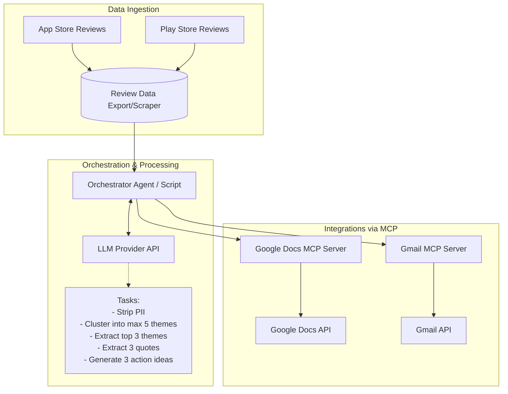

# System Architecture

This document outlines the architecture for the Weekly Review Pulse project based on the constraints and requirements of the problem statement. The architecture leverages an orchestrating agent/script, an LLM for natural language processing, and Model Context Protocol (MCP) servers for third-party integrations.

## High-Level Architecture Diagram

## Core Components

### 1. Data Ingestion Layer
- **Responsibility**: Fetch raw, public reviews from the last 8-12 weeks from both the Apple App Store and Google Play Store.
- **Implementation**: Could be static exports (e.g., CSV/JSON files) or simple public API scrapers (respecting Terms of Service and avoiding login walls). 
- **Data Privacy**: A local preprocessing step must ensure no PII (like usernames or device IDs) is passed along to the next layers.

### 2. Orchestrator Agent
- **Responsibility**: Coordinates the end-to-end flow. It triggers the data fetch, sends the prompt and data to the LLM, and dispatches the results to the MCP servers.
- **Implementation**: A lightweight Node.js or Python script, or a dedicated AI agent framework.

### 3. LLM Processing Engine
- **Responsibility**: Analyzes the raw review data to generate the required insights.
- **Prompts & Instructions**:
  1. Read the provided reviews.
  2. Cluster them into a maximum of 5 themes.
  3. Filter down to the Top 3 themes.
  4. Extract 3 verbatim, anonymous user quotes.
  5. Recommend 3 concrete action ideas based on the findings.
  6. Format the output into a scannable, one-page weekly note (≤250 words).

### 4. Integrations Layer (MCP Servers)
Instead of directly writing REST API integration code for Google services, the system interacts with standardized MCP servers. This decouples the agent logic from the complexities of OAuth and Google API client libraries.

- **Google Docs MCP Server**: Exposes tools (e.g., `create_document`, `append_text`) that the Orchestrator calls to generate the written weekly pulse.
- **Gmail MCP Server**: Exposes tools (e.g., `create_draft`) to compile a draft email containing a summary and a link to the generated Google Doc, sending it to the user's alias.

## Data Flow
1. **Extract**: Reviews are pulled locally and stripped of PII.
2. **Analyze**: The Orchestrator sends the review context to the LLM to process and format the insights.
3. **Publish**: The Orchestrator passes the LLM-generated markdown/text to the Google Docs MCP server to create the weekly pulse document.
4. **Notify**: The Orchestrator passes a summary and the Google Doc URL to the Gmail MCP server to draft the final notification email.
